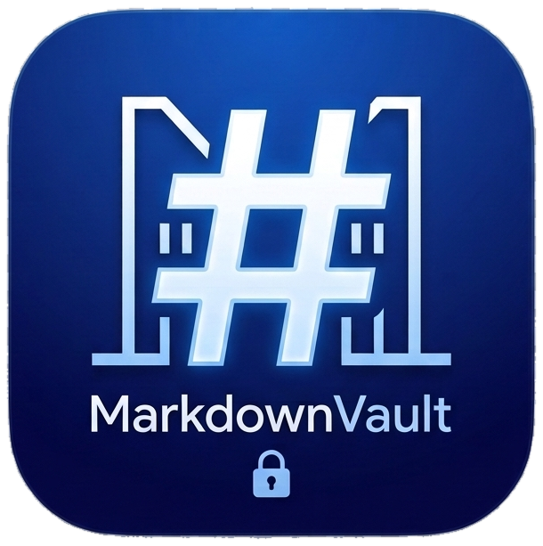
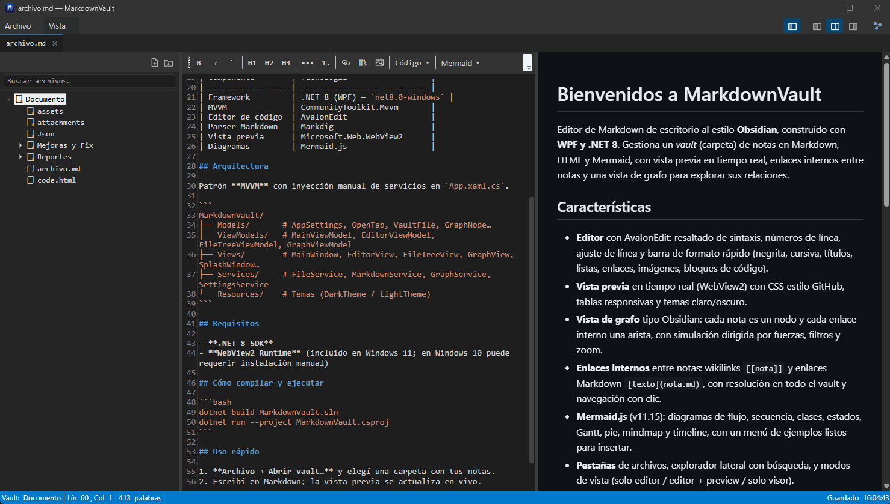
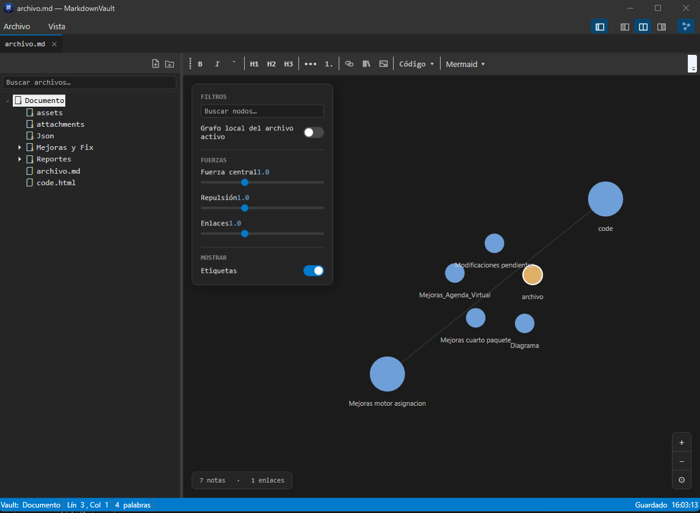

<p align="center">
  
</p>

<h1 align="center">MarkdownVault</h1>

Editor de Markdown de escritorio al estilo **Obsidian**, construido con **WPF y .NET 8**. Gestiona un *vault* (carpeta) de notas en Markdown, HTML y Mermaid, con vista previa en tiempo real, enlaces internos entre notas y una vista de grafo para explorar sus relaciones.

## Vista previa

**Editor + vista previa en tiempo real**



**Vista de grafo de notas enlazadas**



## Características

- **Editor** con AvalonEdit: resaltado de sintaxis, números de línea, ajuste de línea y barra de formato rápido (negrita, cursiva, títulos, listas, enlaces, imágenes, bloques de código).
- **Vista previa** en tiempo real (WebView2) con CSS estilo GitHub, tablas responsivas y temas claro/oscuro.
- **Vista de grafo** tipo Obsidian: cada nota es un nodo y cada enlace interno una arista, con simulación dirigida por fuerzas, filtros y zoom. Los nodos que arrastrás quedan fijos donde los soltás (clic derecho sobre el nodo, o el botón 📌, los libera).
- **Enlaces internos** entre notas: wikilinks `[[nota]]` y enlaces Markdown `[texto](nota.md)`, con resolución en todo el vault y navegación con clic.
- **Mermaid.js** (v11.15): diagramas de flujo, secuencia, clases, estados, Gantt, pie, mindmap y timeline, con un menú de ejemplos listos para insertar.
- **Pestañas** de archivos, explorador lateral con búsqueda, y modos de vista (solo editor / editor + preview / solo visor).
- **Temas** claro/oscuro (estilo VS Code) con persistencia, incluida la barra de título nativa.
- **Imágenes**: arrastrar y soltar, y pegar capturas de pantalla (Ctrl+V) directo a `attachments/`.
- **Auto-guardado** y exportación de la vista previa a PNG.

## Complementos (Plugins)

MarkdownVault tiene un sistema de plugins de primera parte: funciones como Mermaid, el resaltado de sintaxis o los callouts no están cableadas a mano en el núcleo de la app — se cargan **dinámicamente** desde la carpeta `Plugins/` junto al ejecutable.

- **Carga dinámica**: cada plugin es una carpeta con un manifiesto (`plugin.json`) y un ensamblado `.dll`, detectados y cargados al arrancar sin recompilar la app.
- **Activar / desactivar**: desde el menú **Complementos** podés prender o apagar cada uno; el estado se persiste entre sesiones.
- **Aislado**: si un plugin falla al activarse queda marcado en rojo con su error — la app sigue funcionando con normalidad, no se cae.

Plugins incluidos:

| Plugin | Qué hace |
| ------ | -------- |
| **Mermaid** | Diagramas de flujo, secuencia, clases, estados, Gantt, pie, mindmap y timeline en bloques ` ```mermaid `. |
| **Resaltado de sintaxis** | Colorea el código de los bloques en la vista previa (highlight.js). |
| **Callouts** | Alertas estilo Obsidian (`> [!note] Mi título`, con título en línea) con estilo propio. |
| **Eisenhower** | Matriz de tareas urgente/importante, con ventana dedicada y grilla opcional embebible con un bloque `` ```eisenhower ``. |
| **Lector de Documentos** | Lee el documento (o la selección) en voz alta con Piper: síntesis local, sin internet ni cuentas. |
| **Dictado y Transcripción de Voz** | Transcribe un audio o dicta en vivo por micrófono con whisper.cpp: reconocimiento local, sin internet ni cuentas. |

Guía de uso de cada plugin: [`docs/plugins/PLUGINS.md`](docs/plugins/PLUGINS.md) (y [`docs/plugins/EISENHOWER.md`](docs/plugins/EISENHOWER.md), [`docs/plugins/LECTOR-DOCUMENTOS.md`](docs/plugins/LECTOR-DOCUMENTOS.md) y [`docs/plugins/DICTADO-VOZ.md`](docs/plugins/DICTADO-VOZ.md) para el detalle de esos tres). Para desarrollar un plugin propio: [`docs/plugins/GUIA-PLUGINS.md`](docs/plugins/GUIA-PLUGINS.md).

## Stack

| Componente        | Tecnología                  |
| ----------------- | --------------------------- |
| Framework         | .NET 8 (WPF) — `net8.0-windows` |
| MVVM              | CommunityToolkit.Mvvm       |
| Editor de código  | AvalonEdit                  |
| Parser Markdown   | Markdig                     |
| Vista previa      | Microsoft.Web.WebView2      |
| Diagramas         | Mermaid.js                  |
| Plugins           | SDK propio + `AssemblyLoadContext` (carga dinámica) |

## Arquitectura

Patrón **MVVM** con inyección manual de servicios en `App.xaml.cs`.

```
MarkdownVault/
├── Models/         # AppSettings, OpenTab, VaultFile, GraphNode…
├── ViewModels/     # MainViewModel, EditorViewModel, FileTreeViewModel, GraphViewModel
├── Views/          # MainWindow, EditorView, FileTreeView, GraphView, SplashWindow…
├── Services/       # FileService, MarkdownService, GraphService, SettingsService
│   └── Plugins/    # PluginManager, PluginRegistry, HostServices, PluginStorage, PathConfinement…
│                    # (descubrimiento, carga aislada vía AssemblyLoadContext, ciclo de vida)
├── PluginSdk/      # El contrato compartido host↔plugins: IPlugin, IPluginContext, IHostServices, IPluginStorage…
├── Resources/      # Temas (DarkTheme / LightTheme)
└── plugins/        # Plugins de primera parte (fuente): Mermaid, Highlight, Callouts, Eisenhower,
                    # LectorDocumentos (incluye runtime/ con piper.exe y las voces),
                    # DictadoVoz (incluye runtime/ con whisper-server.exe y ffmpeg.exe)
```

## Requisitos

- **.NET 8 SDK**
- **WebView2 Runtime** (incluido en Windows 11; en Windows 10 puede requerir instalación manual)

## Cómo compilar y ejecutar

```bash
dotnet build MarkdownVault.sln
dotnet run --project MarkdownVault.csproj
```

## Uso rápido

1. **Archivo → Abrir vault…** y elegí una carpeta con tus notas.
2. Escribí en Markdown; la vista previa se actualiza en vivo.
3. Enlazá notas con `[[nombre]]` o desde la barra (*Insertar enlace interno*).
4. Insertá diagramas desde el menú **Mermaid ▾**.
5. Abrí la **vista de grafo** para ver cómo se conectan tus notas.
