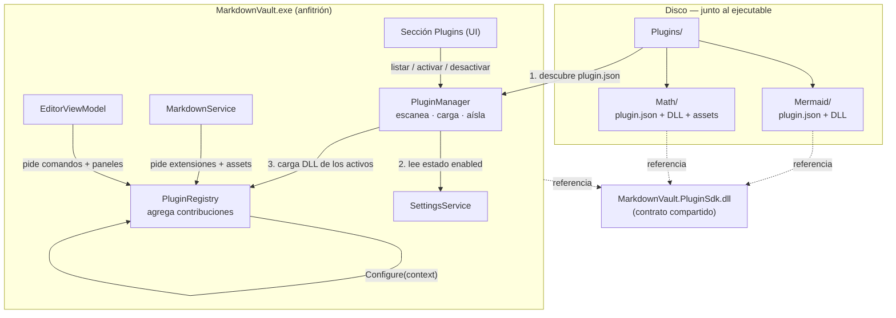

# Guía de Desarrollo de Plugins — MarkdownVault

> **Estado del documento:** DISEÑO / ESPECIFICACIÓN + implementación en curso.
> Este manual es la fuente de verdad del contrato. Versión del SDK: **1.4.0**.

### Estado de implementación (migración de Mermaid)

| Pieza | Estado |
|---|---|
| `MarkdownVault.PluginSdk` (contratos) | ✅ Implementado |
| `PluginRegistry` / `PluginManager` / carga dinámica (`AssemblyLoadContext`) | ✅ Implementado |
| Refactor de `MarkdownService` para inyectar `PreviewAsset` del registry | ✅ Implementado |
| Plugin **Mermaid** (fuente en `plugins/Mermaid/`) cargado desde `Plugins/Mermaid/` en runtime | ✅ Implementado |
| **Sección de UI** (Menú *Complementos → Administrar plugins…*): lista, activa/desactiva, muestra fallidos + persistencia en `AppSettings.PluginsEnabled` | ✅ Implementado |
| **Tests** (`tests/MarkdownVault.Tests`, xUnit): PluginRegistry, PluginManifest, PluginManager (discovery/validación), SettingsService | ✅ 22 tests en verde |
| Plugin **Syntax Highlighting** (`plugins/Highlight/`) — highlight.js vía `PreviewAsset` | ✅ Implementado |
| Refactor del **pipeline de Markdig** (`MarkdownService.GetPipeline`) para consumir `IMarkdownContribution` de los plugins | ✅ Implementado |
| Plugin **Callouts** (`plugins/Callouts/`) — extensión Markdig (forma Obsidian con título en línea) + CSS que estiliza los alerts | ✅ Implementado |
| **Barra de herramientas contribuida** — los plugins aportan `PluginCommand` (botón) y `PluginCommandGroup` (dropdown) a la toolbar del editor, vía `IEditorContext`. El dropdown de **Mermaid** se migró del core al plugin Mermaid | ✅ Implementado |
| **Descarga real de ensamblados** — `AssemblyLoadContext` collectible; desactivar quita las contribuciones (`RemoveByOwner`) y descarga el DLL (`Unload` + GC); reactivar lo recarga. Los plugins deshabilitados NO se cargan al arrancar | ✅ Implementado |
| **Tests de integración** — carga real de DLLs vía ALC, ciclo desactivar/reactivar, y verificación de unload con `WeakReference` | ✅ 26 tests en verde (24 + 2 integración) |

> **UI esencial vs UI de feature:** los botones de formato (Bold, H1, listas…) siguen
> siendo **core** (siempre presentes) — no se convirtieron en plugin soltable, porque
> si el DLL faltara la app arrancaría sin barra de formato. Sólo las herramientas
> *propias de una feature* (el dropdown de Mermaid) viven en su plugin: al desactivar
> Mermaid, su menú se va con él.

> **Compartir Markdig con los plugins:** los plugins de sintaxis referencian Markdig
> con `ExcludeAssets=runtime` (no lo copian) y `PluginLoadContext` lo comparte (junto
> al SDK) devolviendo `null` en `Load`, para que `IMarkdownExtension` tenga la misma
> identidad de tipo en host y plugin.
>
> **Ojo — descubrimiento:** el `UseAdvancedExtensions()` de Markdig **1.1.2 ya
> renderiza los GitHub alerts** (`> [!note]` → `div.markdown-alert`) de forma nativa,
> pero sin estilo y sin soportar la forma Obsidian con título en línea
> (`> [!note] Mi título`). Por eso el plugin Callouts (a) estiliza los alerts nativos
> y (b) su extensión Markdig sólo captura la forma con título en línea (la que el base
> no maneja).

> **Correr los tests:** `dotnet test MarkdownVault.sln`. No cubren la activación
> exitosa de un plugin (requiere un DLL real), validada end-to-end con Mermaid.

> **Cómo verificar la migración:** compilá la **solución** (no solo el proyecto host)
> para que el plugin se copie a `bin/<Config>/net8.0-windows/Plugins/Mermaid/`.
> Abrí un `.md` con un bloque ` ```mermaid ` y confirmá que renderiza el diagrama.
> Si no renderiza, revisá que el DLL y el `plugin.json` estén en esa carpeta.

---

## Tabla de contenidos

1. [Filosofía](#1-filosofía)
2. [Arquitectura en un minuto](#2-arquitectura-en-un-minuto)
3. [Los tres ensamblados](#3-los-tres-ensamblados)
4. [Anatomía de un plugin en disco](#4-anatomía-de-un-plugin-en-disco)
5. [El contrato (referencia del SDK)](#5-el-contrato-referencia-del-sdk)
6. [Tipos de contribución](#6-tipos-de-contribución)
7. [Tu primer plugin, paso a paso](#7-tu-primer-plugin-paso-a-paso)
8. [Ejemplo completo: Mermaid como plugin](#8-ejemplo-completo-mermaid-como-plugin)
9. [Cómo la app detecta, lista, activa y desactiva](#9-cómo-la-app-detecta-lista-activa-y-desactiva)
10. [Empaquetado y distribución](#10-empaquetado-y-distribución)
11. [Versionado del contrato](#11-versionado-del-contrato)
12. [Solución de problemas](#12-solución-de-problemas)
13. [Checklist del autor de plugins](#13-checklist-del-autor-de-plugins)

---

## 1. Filosofía

**Un plugin NO modifica la app. Un plugin APORTA contribuciones a puntos de
extensión que la app expone.** La app las recolecta y las consume.

Esto se llama **Contribution Model**. Reglas de oro:

- Un plugin nunca referencia `MarkdownVault.exe` ni sus clases internas
  (`FileService`, `EditorViewModel`, etc.).
- Un plugin solo conoce el **SDK** (`MarkdownVault.PluginSdk`).
- Un plugin recibe una fachada de solo-lectura del host (`IHostServices`);
  jamás recibe los servicios crudos, así no puede, por ejemplo, borrar el vault.
- Si un plugin falla, **degrada** (queda marcado como fallido) pero **no tumba**
  la aplicación.

Los plugins son **de primera parte** (los escribís vos), pero se **cargan
dinámicamente** desde una carpeta `Plugins/`. Eso te da modularidad: agregar un
plugin nuevo NO requiere recompilar la app.

---

## 2. Arquitectura en un minuto



**Flujo de arranque:**

1. La app escanea la carpeta `Plugins/`.
2. Por cada subcarpeta, lee su `plugin.json` (barato, sin ejecutar código).
   Con eso ya puede **listar** el plugin en la UI.
3. Para los plugins marcados como **activos** en settings, carga su DLL,
   encuentra la clase `IPlugin`, la instancia y llama `Configure(context)`.
4. El plugin registra sus contribuciones en el `PluginRegistry`.
5. `MarkdownService`, `EditorViewModel`, etc. consultan el registry para
   renderizar / mostrar comandos.

---

## 3. Los tres ensamblados

| Ensamblado | Qué es | Quién lo referencia |
|---|---|---|
| `MarkdownVault.exe` | La app anfitriona (host) | — |
| `MarkdownVault.PluginSdk.dll` | **El contrato**: interfaces y tipos que definen qué es un plugin | El host **y** cada plugin |
| `MarkdownVault.Plugin.*.dll` | Un plugin concreto (uno por carpeta) | Solo referencia al SDK |

> **Por qué el SDK es obligatorio:** en .NET la identidad de un tipo depende del
> ensamblado que lo define. Si el host definiera `IPlugin` en `MarkdownVault.exe`
> y el plugin definiera "su propio" `IPlugin`, para el runtime serían tipos
> DISTINTOS y el `as IPlugin` daría `null`. El SDK compartido garantiza que ambos
> hablan del **mismo** `IPlugin`.

**Regla de dependencias (estricta):**

```
MarkdownVault.exe  ──►  MarkdownVault.PluginSdk  ◄──  MarkdownVault.Plugin.Mermaid
```

El SDK **no depende de nadie**. Es un contrato puro (interfaces + POCOs + enums).
No mete WPF, ni Markdig, ni WebView2. Así un plugin queda liviano y estable.

---

## 4. Anatomía de un plugin en disco

Cada plugin vive en **su propia subcarpeta** dentro de `Plugins/`. Un plugin =
una carpeta autocontenida:

```
MarkdownVault/                       (junto al .exe)
└── Plugins/
    ├── Mermaid/
    │   ├── plugin.json              ← manifiesto (obligatorio)
    │   └── MarkdownVault.Plugin.Mermaid.dll
    └── Math/
        ├── plugin.json
        ├── MarkdownVault.Plugin.Math.dll
        └── assets/
            ├── katex.min.js         ← recursos empaquetados (opcional)
            └── katex.min.css
```

### El manifiesto: `plugin.json`

Es la **fuente autoritativa de metadata**. La app lo lee SIN cargar el DLL, así
puede listar el plugin (nombre, versión, autor) y decidir compatibilidad antes
de ejecutar una sola línea de su código.

```json
{
  "id": "core.mermaid",
  "name": "Mermaid Diagrams",
  "version": "1.0.0",
  "description": "Renderiza bloques ```mermaid como diagramas en la vista previa.",
  "author": "MarkdownVault",
  "entry": "MarkdownVault.Plugin.Mermaid.dll",
  "minSdk": "1.0.0"
}
```

| Campo | Obligatorio | Descripción |
|---|---|---|
| `id` | Sí | Identificador único y estable (formato `namespace.nombre`). Es la clave en settings. **No lo cambies nunca** una vez publicado. |
| `name` | Sí | Nombre visible en la sección de Plugins. |
| `version` | Sí | SemVer del plugin. |
| `description` | Sí | Una línea para la UI. |
| `author` | No | Autor / origen. |
| `entry` | Sí | Nombre del DLL que contiene la clase `IPlugin`. |
| `minSdk` | Sí | Versión mínima del SDK que el plugin necesita. La app rechaza cargarlo si su SDK es más viejo. |

---

## 5. El contrato (referencia del SDK)

Todo esto vive en `MarkdownVault.PluginSdk`. Es lo ÚNICO que un plugin necesita
conocer.

### `IPlugin` — el punto de entrada

```csharp
namespace MarkdownVault.PluginSdk;

/// <summary>
/// Contrato mínimo de un plugin. La app instancia esta clase (constructor sin
/// parámetros) y llama Configure una vez, al activar el plugin.
/// </summary>
public interface IPlugin
{
    /// <summary>
    /// Se llama una vez cuando el plugin se activa. Acá el plugin registra
    /// TODAS sus contribuciones a través del contexto. No hagas trabajo pesado
    /// ni I/O bloqueante aquí.
    /// </summary>
    void Configure(IPluginContext context);
}
```

> La metadata (id, nombre, versión) **no** se declara en código: vive en
> `plugin.json`. Así la app lista plugins sin ejecutarlos. La clase `IPlugin`
> solo aporta comportamiento.

### `IActivatablePlugin` — ciclo de vida opcional

Si tu plugin necesita inicializar/liberar recursos (timers, archivos, etc.),
implementá también esta interfaz:

```csharp
public interface IActivatablePlugin : IPlugin
{
    Task OnActivatedAsync();     // tras Configure, cuando el usuario lo activa
    Task OnDeactivatedAsync();   // cuando el usuario lo desactiva
}
```

### `IPluginContext` — lo que el host te entrega

```csharp
public interface IPluginContext
{
    /// <summary>Fachada de solo-lectura hacia el host.</summary>
    IHostServices Host { get; }

    /// <summary>Almacenamiento sandbox por plugin (lectura y escritura), aislado del vault.</summary>
    IPluginStorage Storage { get; }

    /// <summary>Metadata resuelta desde el plugin.json (id, versión, etc.).</summary>
    PluginMetadata Metadata { get; }

    // ── Métodos de registro de contribuciones ──
    void AddMarkdownExtension(IMarkdownContribution extension, int order = 0);
    void AddPreviewAsset(PreviewAsset asset);
    void AddCommand(PluginCommand command);
    void AddCommandGroup(PluginCommandGroup group);
    void AddPanel(PluginPanel panel);

    /// <summary>
    /// Registra una LISTA EDITABLE que el host dibuja en la ventana de
    /// complementos (SDK 1.4.0). Ver la sección "PluginListSetting" en
    /// [tipos de contribución](#6-tipos-de-contribución).
    /// </summary>
    void AddListSetting(PluginListSetting setting);

    void OnVaultEvent(Action<VaultEvent> handler);

    /// <summary>
    /// Log de diagnóstico. Va a DOS destinos: la consola del depurador
    /// (`Debug.WriteLine`) y un ARCHIVO legible,
    /// `%AppData%/MarkdownVault/logs/plugins.log` (SDK 1.3.0+). Nunca lanza.
    /// </summary>
    void Log(string message);

    /// <summary>
    /// Pide un re-render del preview activo aunque el contenido no haya cambiado
    /// (p. ej. después de escribir en <c>Storage</c>). Sincrónico, sin marshaling
    /// de hilo a cargo del llamador; no-op seguro si no hay documento abierto.
    /// </summary>
    void RequestPreviewRefresh();
}
```

### `IHostServices` — la fachada segura

```csharp
public interface IHostServices
{
    string? VaultRoot { get; }
    string? ActiveFilePath { get; }
    bool    IsDarkTheme { get; }

    Task<string> ReadFileAsync(string relativePath);

    /// Aviso INSTANTÁNEO en la barra de estado (esquina inferior derecha).
    /// Para operaciones LARGAS usá BeginProgress: esto es letra chica en un
    /// rincón y no alcanza para contar minutos de trabajo.
    void ShowStatus(string message);

    /// Canal de progreso VISIBLE para una operación larga (SDK 1.3.0+).
    /// Nunca devuelve null. Ver la sección siguiente.
    IProgressScope BeginProgress(string title);

    /// Abre relativePath en el editor del host. Confinado al vault: no-op
    /// silencioso (nunca lanza) si la ruta escapa del vault o no existe.
    void OpenVaultFile(string relativePath);
}
```

> **Fijate qué NO está acá:** no hay `WriteFile`, no hay `Delete`, no hay acceso
> al `FileSystemWatcher`. Un plugin **no puede** modificar el vault. Esta
> superficie mínima es intencional. Si un plugin necesita persistir datos
> propios (caché, configuración, estado), usa `IPluginStorage` (abajo) — un
> sandbox separado del vault, no un permiso para escribir en él.

### `IProgressScope` — progreso de operaciones largas (SDK 1.3.0+)

`ShowStatus` alcanza para "ya está" y NO alcanza para "esto va a tardar tres
minutos". Un plugin que descarga 574 MB y después transcribe durante minutos
usando solo `ShowStatus` produce una aplicación que **parece colgada** — pasó de
verdad con `core.dictado-voz`. `BeginProgress` es el canal para eso: una barra
real, de ancho completo, con título, paso actual, porcentaje y botón de cancelar.

```csharp
public interface IProgressScope : IDisposable
{
    /// Se dispara cuando el usuario aprieta «Cancelar» en la barra.
    CancellationToken CancellationToken { get; }
    bool IsCancellationRequested { get; }

    /// percent va de 0 a 100 (NO de 0 a 1). null ⇒ modo INDETERMINADO.
    /// message vacío CONSERVA el mensaje anterior.
    void Report(double? percent, string message);

    /// Cambia solo el mensaje, conservando el modo actual.
    void Report(string message);
}

/// Scope que no hace nada. El host lo devuelve cuando no hay barra conectada,
/// y sirve como valor por defecto en helpers del plugin.
public sealed class NoOpProgressScope : IProgressScope
{
    public static readonly IProgressScope Instance;
}
```

Uso típico:

```csharp
using var progreso = context.Host.BeginProgress("Dictado de voz");

progreso.Report(null, "Preparando el motor…");          // indeterminado
progreso.Report(42, "Descargando el modelo (547 MB)…"); // 42 %

var texto = await MotorAsync(progreso.CancellationToken);   // cancelable
```

Reglas del contrato — el host las cumple, el plugin puede confiar en ellas:

- **Ciclo de vida determinista.** La barra aparece con `BeginProgress` y
  desaparece con `Dispose`. Usá `using`. `Dispose` **no cancela**: disponer
  significa "terminé", no "abortá" — si cancelara, todo `using` mataría su propio
  trabajo al salir del bloque.
- **Hilos: problema del host, no tuyo.** `Report` se puede llamar desde
  CUALQUIER hilo; el traslado al hilo de interfaz lo hace el host (mismo criterio
  que `ShowStatus`). Un plugin **nunca** necesita saber qué es un `Dispatcher`
  para reportar progreso. Las ráfagas se fusionan del lado del host: reportar
  cada 0,5 % de una descarga no satura nada.
- **Cancelación de verdad.** El `CancellationToken` del scope es el mismo botón
  que el usuario ve. Observalo en tus bucles y pasalo a tus llamadas asíncronas.
  Esto **reemplaza** tener que agregar un ítem "Cancelar" en tu propio menú.
- **Concurrencia: pila (LIFO), no cola.** Puede haber varios scopes vivos a la
  vez (dos plugins, o un plugin con dos trabajos). Se muestra **el más reciente**;
  al cerrarlo reaparece el anterior, y la barra anota "+N en segundo plano".
  *Por qué pila y no cola:* los trabajos largos se **anidan por causalidad** (la
  transcripción abre el arranque del motor, que abre la descarga del modelo). Con
  una cola FIFO se mostraría el más viejo y el paso que realmente avanza —el de
  adentro— nunca se vería, que es justo el problema que esto viene a resolver.
  Además, el scope más nuevo es el que el usuario acaba de provocar con un clic.
- **Descarga en caliente.** Al desactivar un plugin, el host **cancela y cierra
  TODOS** sus scopes (ver [sección 9](#9-cómo-la-app-detecta-lista-activa-y-desactiva)).
  Después de eso, `Report` y `Dispose` son no-ops silenciosos: nunca lanzan.
- **No retiene tipos del plugin.** Un scope guarda solo texto, un número y un
  `CancellationTokenSource` — todos tipos del framework. El host no se queda con
  ningún delegate ni tipo definido por vos, así que la barra no clava tu
  `AssemblyLoadContext`.
- **Sin temporizador de rescate — a propósito.** Si un plugin se olvida de
  disponer el scope, la barra queda visible. NO hay timeout: un temporizador
  tendría que adivinar cuánto es "demasiado" y se equivocaría con una descarga de
  574 MB en una conexión lenta. Hay dos salidas deterministas en su lugar:
  (a) el botón de cancelar es de **dos tiempos** — la primera pulsación dispara el
  token y el botón pasa a decir «Descartar», la segunda saca la barra aunque el
  plugin nunca haya cooperado; (b) desactivar el plugin barre todos sus scopes.
  Igual: **disponé tu scope**. Que exista una red no es permiso para caerse.

> **Elegir el canal correcto:** `ShowStatus` para lo instantáneo (guardado,
> error, "no se detectó habla"); `BeginProgress` para todo lo que el usuario
> tenga que ESPERAR; `Log` para el detalle técnico que nadie mira salvo cuando
> algo falla.

### `IPluginStorage` — persistencia sandbox por plugin (SDK 1.1.0+)

Cada plugin recibe su propio espacio de almacenamiento de lectura/escritura,
completamente aislado del vault del usuario y de los demás plugins:

```csharp
public interface IPluginStorage
{
    /// <summary>Raíz absoluta del sandbox de este plugin. Puede no existir aún en disco.</summary>
    string RootPath { get; }

    /// <summary>Lee el texto completo en <paramref name="relativePath"/>. Lanza si no existe.</summary>
    Task<string> ReadTextAsync(string relativePath);

    /// <summary>
    /// Escribe (reemplazando por completo) el texto en <paramref name="relativePath"/>,
    /// creando la raíz del sandbox y cualquier subcarpeta intermedia si hace falta.
    /// </summary>
    Task WriteTextAsync(string relativePath, string content);

    /// <summary>Indica si existe un archivo en <paramref name="relativePath"/>.</summary>
    bool Exists(string relativePath);

    /// <summary>Borra el archivo en <paramref name="relativePath"/>. Idempotente: no lanza si no existe.</summary>
    void Delete(string relativePath);
}
```

Se accede vía `context.Storage` (en `Configure`) o `ctx.Storage` (si el plugin
guardó el `IPluginContext` recibido). Detalles clave:

- **Sandbox por plugin, bajo `%AppData%/MarkdownVault/PluginData/<plugin-id>/`.**
  Cada plugin ve únicamente su propia carpeta (`RootPath`), identificada por el
  `id` de su `plugin.json` — nunca el vault del usuario, nunca la carpeta de
  otro plugin.
- **Confinamiento estricto.** Toda ruta relativa se resuelve contra `RootPath`
  ANTES de tocar el disco. Si el resultado escapa del sandbox (`..`,
  `../../otro-plugin/x`, una ruta absoluta como `C:\Windows\...`), el método
  lanza `UnauthorizedAccessException` — sin excepción, sin fallback silencioso.
  Esta es la MISMA resolución de rutas (`PathConfinement`) que usa
  `IHostServices.ReadFileAsync` para el vault.
  > **Límite conocido:** la resolución es léxica (`Path.GetFullPath`); no
  > resuelve symlinks ni junctions. Igual que la garantía existente de
  > `ReadFileAsync` — aceptable bajo el modelo de confianza de primera parte
  > (ver debajo), pendiente de endurecer si algún día se cargan plugins de
  > terceros no confiables.
- **Raíz perezosa (`lazy`).** El directorio del sandbox NO se crea al activar
  el plugin ni al leer (`Exists`/`Read*` sobre una raíz inexistente se
  comportan como "no existe" / lanzan, no crean nada). Solo `WriteTextAsync`
  crea la raíz (y subcarpetas intermedias) la primera vez que escribe.
- **Texto UTF-8 sin BOM.** Distinto del vault (que preserva BOM si el archivo
  original lo tenía): `Storage` siempre escribe UTF-8 sin marca de orden de
  bytes, por simplicidad y consistencia entre plugins.
- **Confianza de primera parte, sin flag de permiso todavía.** Hoy CUALQUIER
  plugin activo tiene acceso automático a su `Storage` — no hay un permiso
  explícito que el usuario deba otorgar (los plugins siguen siendo de primera
  parte, igual que en el resto de esta guía). Si en el futuro se soportan
  plugins de terceros, este acceso pasará a ser un permiso auditado y
  visible en la UI, no automático.

---

## 6. Tipos de contribución

Estos son los puntos de extensión que la app expone. Salen de las costuras
reales del código actual.

| Contribución | Qué permite | Dónde engancha en la app |
|---|---|---|
| **PreviewAsset** | Inyectar CSS o JS en la página HTML de la vista previa | `MarkdownService.WrapInPage` |
| **MarkdownExtension** | Agregar sintaxis nueva Markdown → HTML | El pipeline de Markdig en `MarkdownService` |
| **Command** | Agregar un botón/acción a la toolbar o paleta del editor | Los comandos de `EditorViewModel` |
| **Panel** | Aportar una vista lateral (como el grafo) | El mecanismo de `GraphView` |
| **ListSetting** | Una lista editable (clave, o clave+valor) que el HOST dibuja en la ventana de Complementos (SDK 1.4.0) | `PluginsWindow.xaml` / `PluginListSettingViewModel` |
| **VaultEvent** | Reaccionar a cambios de archivos del vault | Los eventos de `FileService` |

### `PreviewAsset`

El más usado. Inyecta recursos en la página de preview.

```csharp
public enum AssetKind      { Style, Script }
public enum AssetSource    { Inline, Url, BundledFile }   // BundledFile = archivo dentro de la carpeta del plugin (assets/)
public enum AssetPlacement { HeadStart, HeadEnd, BodyEnd }

public sealed class PreviewAsset
{
    public AssetKind      Kind      { get; init; }
    public AssetSource    Source    { get; init; }
    public string         Value     { get; init; } = "";   // el CSS/JS inline, la URL, o la ruta relativa del archivo
    public AssetPlacement Placement { get; init; } = AssetPlacement.HeadEnd;
}
```

### `PluginCommand`

```csharp
public sealed class PluginCommand
{
    public string Id      { get; init; } = "";
    public string Title   { get; init; } = "";
    public string? Icon   { get; init; }   // nombre de glifo o ruta a icono empaquetado
    public Action<IEditorContext> Execute { get; init; } = _ => { };
}

public interface IEditorContext
{
    /// <summary>Texto completo del documento activo.</summary>
    string Content { get; }

    /// <summary>Texto actualmente seleccionado (cadena vacía si no hay selección).</summary>
    string SelectedText { get; }

    /// <summary>Inserta texto en el cursor (en una línea nueva si hace falta).</summary>
    void InsertAtCaret(string text);

    /// <summary>Envuelve la selección con before/after.</summary>
    void WrapSelection(string before, string after);

    /// <summary>Reemplaza la selección (o inserta en el cursor si no hay selección).</summary>
    void ReplaceSelection(string text);
}
```

> **Límite conocido:** no hay forma de seleccionar un rango POR CÓDIGO. Un plugin
> no puede insertar un marcador de progreso en el documento y reemplazarlo
> después: el marcador quedaría como basura que el usuario borra a mano. Para
> avisar de un trabajo largo está `IProgressScope`, no el documento.

> **Icon en botones únicos:** si un `PluginCommand` de botón único (no en un
> `PluginCommandGroup`) declara `Icon` (un glifo de la fuente `Segoe MDL2
> Assets`, ej. `""`), la toolbar lo renderiza como botón-icono usando ese
> glifo, y `Title` pasa a mostrarse como tooltip en vez de como texto del
> botón. Si `Icon` es `null`/vacío, el botón sigue mostrando `Title` como
> texto (comportamiento sin cambios). El dropdown de `PluginCommandGroup` no
> se ve afectado por este cambio.

### `PluginListSetting` (SDK 1.4.0)

**El porqué antes que el cómo.** La [sección 9](#plugins-con-ui-wpf-y-descarga-en-caliente)
documenta una limitación dura: un plugin que declara su propio tipo derivado de
`System.Windows.Window` (o cualquier `DependencyObject`) clava las cachés estáticas de WPF
a nivel PROCESO y pierde la descarga en caliente — el caso conocido de `EisenhowerWindow`.
`PluginListSetting` es la salida a eso para el caso más común de "un plugin necesita
configuración editable": **el host dibuja la ventana, el plugin solo declara los datos y
sus reglas**. Lo único que cruza la frontera son strings y delegates — exactamente lo mismo
que ya cruza con `PluginCommand`, que se descarga sin problemas. Cero tipos de WPF del lado
del plugin ⇒ cero riesgo de pin.

```csharp
public readonly record struct PluginListEntry(string Key, string? Value);

public sealed class PluginListSetting
{
    public string  Id          { get; init; } = "";   // estable dentro del plugin (ej. "core.dictado.glosario")
    public string  Title       { get; init; } = "";   // rótulo, tal como lo lee el usuario
    public string? Description { get; init; }         // una línea explicando para qué sirve. Opcional.
    public string  KeyLabel    { get; init; } = "";    // encabezado de la primera columna (ej. "Término")
    public string? ValueLabel  { get; init; }          // encabezado de la segunda. null ⇒ una sola columna

    public Func<IReadOnlyList<PluginListEntry>>   Load     { get; init; } = () => Array.Empty<PluginListEntry>();
    public Action<IReadOnlyList<PluginListEntry>> Save     { get; init; } = _ => { };
    public Func<IReadOnlyList<PluginListEntry>, string?>? Describe { get; init; }
}
```

**Qué hace el host, qué hace el plugin.** El host se encarga de TODO lo genérico: agregar,
editar, borrar (fila por fila), filtrar por texto, avisar entradas vacías o duplicadas (sin
distinguir mayúsculas — ver más abajo) y el guardado explícito con botones «Guardar» /
«Descartar». El plugin se encarga solo de lo SUYO: de dónde salen los datos (`Load`), adónde
van (`Save`) y qué significan (`Describe`, opcional).

**`ValueLabel` habilita una segunda columna.** `null` ⇒ la lista tiene una sola columna y
`PluginListEntry.Value` viaja siempre en `null` (es el caso de `core.dictado-voz`: el
glosario es una lista de términos, no un mapa). Con `ValueLabel` puesto, la fila muestra dos
cajas de texto — clave y valor. Es el caso del diccionario de pronunciación del **Lector de
Documentos** (`core.lector-documentos`): son los MISMOS términos que el glosario del dictado,
con su pronunciación al lado.

**Los dos consumidores difieren en algo que conviene entender**, porque ilustra qué debería
decir `Describe`: en `core.dictado-voz` el glosario se le pasa a `whisper-server` como
argumento AL ARRANCAR, así que un término nuevo no surte efecto hasta reiniciar el motor — y
`Describe` lo AVISA. En `core.lector-documentos` no hace falta reiniciar nada: `piper.exe` se
lanza en cada lectura y el diccionario se aplica al texto antes de sintetizar, así que el
término nuevo entra en la lectura siguiente. Ahí `Describe` no muestra advertencia alguna, y
esa ausencia es la información.

La regla que sale de eso: `Describe` no es para adornar con un contador. Es para decirle al
usuario **qué le falta hacer para que lo que acaba de guardar tenga efecto** — y si no le
falta nada, callarse.

**Garantía del contrato: `Save` recibe la lista ya normalizada por el host.** Sin espacios
sobrantes al principio/final de cada columna, sin entradas con la clave vacía, y sin claves
repetidas (se queda con la primera aparición de cada clave). La comparación de duplicados es
`OrdinalIgnoreCase`: "Pipeline" y "pipeline" son la MISMA entrada. Los acentos, en cambio, SÍ
distinguen — "publico" y "público" son dos entradas distintas, que es lo correcto para un
glosario de términos técnicos. Un plugin que implementa `Save` no necesita volver a limpiar
nada: lo que recibe ya está en condiciones de escribirse tal cual.

**Ejemplo mínimo** (glosario de un solo término, ver el caso real completo en
`plugins/DictadoVoz/DictadoVozPlugin.cs`):

```csharp
context.AddListSetting(new PluginListSetting
{
    Id          = "miplugin.terminos",
    Title       = "Términos propios",
    KeyLabel    = "Término",
    ValueLabel  = null,                       // una sola columna
    Load        = () => _terminos.Select(t => new PluginListEntry(t, null)).ToList(),
    Save        = entries =>
    {
        _terminos = entries.Select(e => e.Key).ToList();
        context.Storage.WriteTextAsync("terminos.json", JsonSerializer.Serialize(_terminos))
               .GetAwaiter().GetResult();
    },
    Describe    = entries => $"{entries.Count} términos guardados."
});
```

> **Guardado, no autoguardado.** `Save` se llama solo cuando el usuario aprieta «Guardar» —
> nunca en cada tecla. Si tu delegate tiene un efecto caro o visible (reescribir un archivo,
> reconfigurar un motor en marcha), este es el punto del contrato pensado exactamente para
> eso: el usuario decide cuándo el cambio se hace efectivo, no vos.
>
> **`Save` corre en el hilo de UI.** Tiene que ser corto. Si lanza, el host muestra el mensaje
> de la excepción al lado de la lista y NO da el guardado por hecho — la ventana no se cierra
> sola ni el estado "sin guardar" se limpia. Lo mismo para `Load` (si lanza, la lista arranca
> vacía con un aviso) y `Describe` (si lanza, el host simplemente no muestra nada: no vale la
> pena tumbar la ventana por un cartel informativo).

### `MarkdownExtension`

Envuelve la extensibilidad nativa de Markdig sin exponer Markdig al plugin
directamente (para mantener el SDK libre de dependencias pesadas):

```csharp
public interface IMarkdownContribution
{
    /// <summary>Devuelve la extensión Markdig a registrar en el pipeline.</summary>
    /// El tipo de retorno se resuelve vía el SDK para no filtrar Markdig al contrato.
    object CreateMarkdigExtension();
}
```

> Para el ejemplo de Mermaid **no** necesitás esto: Mermaid funciona con un
> bloque de código ` ```mermaid ` estándar + JS. La extensión Markdown se usa
> para sintaxis NUEVA (callouts, admoniciones, etc.).

---

## 7. Tu primer plugin, paso a paso

### Paso 1 — Crear el proyecto

Una biblioteca de clases .NET que referencia SOLO el SDK:

```xml
<Project Sdk="Microsoft.NET.Sdk">
  <PropertyGroup>
    <TargetFramework>net8.0</TargetFramework>
    <Nullable>enable</Nullable>
    <ImplicitUsings>enable</ImplicitUsings>
    <!-- No copiar el SDK a la salida: el host ya lo trae -->
    <AssemblyName>MarkdownVault.Plugin.MiPlugin</AssemblyName>
  </PropertyGroup>

  <ItemGroup>
    <ProjectReference Include="..\..\MarkdownVault.PluginSdk\MarkdownVault.PluginSdk.csproj">
      <Private>false</Private>            <!-- clave: NO duplicar el SDK.dll -->
      <ExcludeAssets>runtime</ExcludeAssets>
    </ProjectReference>
  </ItemGroup>
</Project>
```

> **Regla de oro del empaquetado:** el DLL del SDK lo provee el host. Un plugin
> **nunca** debe copiar su propio `MarkdownVault.PluginSdk.dll` a `Plugins/`.
> Por eso `<Private>false</Private>`. Si lo duplicás, tenés dos SDK cargados y
> vuelven los problemas de identidad de tipos.

### Paso 2 — Implementar `IPlugin`

```csharp
using MarkdownVault.PluginSdk;

namespace MarkdownVault.Plugin.MiPlugin;

public sealed class MiPlugin : IPlugin
{
    public void Configure(IPluginContext context)
    {
        context.AddCommand(new PluginCommand
        {
            Id      = "miplugin.fecha",
            Title   = "Insertar fecha",
            Execute = editor => editor.InsertAtCaret(DateTime.Now.ToString("yyyy-MM-dd"))
        });
        context.Log("MiPlugin configurado.");
    }
}
```

### Paso 3 — Escribir el `plugin.json`

(Ver [sección 4](#el-manifiesto-pluginjson).)

### Paso 4 — Compilar y depositar

Compilá y copiá la salida a `Plugins/MiPlugin/` junto al `.exe`:

```
Plugins/
└── MiPlugin/
    ├── plugin.json
    └── MarkdownVault.Plugin.MiPlugin.dll
```

### Paso 5 — Abrir la app

Aparece en **Configuración → Plugins**. Activalo. El comando "Insertar fecha"
aparece en el editor. Sin recompilar la app.

---

## 8. Ejemplo completo: Mermaid como plugin

Este es el **caso de prueba base**. Hoy Mermaid está hardcodeado dentro de
`MarkdownService.WrapInPage`. Convertirlo en plugin valida todo el diseño: si
Mermaid —que ya funciona— encaja limpio como plugin, cualquier otro también.

### 8.1 Qué hace Mermaid hoy (estado actual)

En `Services/MarkdownService.cs`, el método `WrapInPage` inyecta dos cosas:

1. En el `<head>`: `<script src="https://cdn.jsdelivr.net/npm/mermaid@11.15.0/dist/mermaid.min.js"></script>`
2. Al final del `<body>`: un `DOMContentLoaded` que busca los bloques
   `pre code.language-mermaid`, los transforma en `<div class="mermaid">` y
   llama `mermaid.run(...)`.

Ambas cosas son **exactamente** dos `PreviewAsset`.

### 8.2 El plugin

**`plugin.json`:**

```json
{
  "id": "core.mermaid",
  "name": "Mermaid Diagrams",
  "version": "1.0.0",
  "description": "Renderiza bloques ```mermaid como diagramas en la vista previa.",
  "author": "MarkdownVault",
  "entry": "MarkdownVault.Plugin.Mermaid.dll",
  "minSdk": "1.0.0"
}
```

**`MermaidPlugin.cs`:**

```csharp
using MarkdownVault.PluginSdk;

namespace MarkdownVault.Plugin.Mermaid;

public sealed class MermaidPlugin : IPlugin
{
    public void Configure(IPluginContext context)
    {
        // 1) Cargar la librería Mermaid en el <head>.
        context.AddPreviewAsset(new PreviewAsset
        {
            Kind      = AssetKind.Script,
            Source    = AssetSource.Url,
            Value     = "https://cdn.jsdelivr.net/npm/mermaid@11.15.0/dist/mermaid.min.js",
            Placement = AssetPlacement.HeadEnd
        });

        // 2) Inicializar Mermaid al cargar el DOM (inline, al final del body).
        context.AddPreviewAsset(new PreviewAsset
        {
            Kind      = AssetKind.Script,
            Source    = AssetSource.Inline,
            Value     = InitScript,
            Placement = AssetPlacement.BodyEnd
        });
    }

    private const string InitScript = """
        document.addEventListener("DOMContentLoaded", function () {
            var blocks = document.querySelectorAll('pre code.language-mermaid');
            if (blocks.length === 0) return;
            var isDark = document.body.classList.contains('dark');
            mermaid.initialize({
                startOnLoad: false,
                theme: isDark ? 'dark' : 'default',
                securityLevel: 'loose'
            });
            blocks.forEach(function (el) {
                var pre = el.parentElement;
                var div = document.createElement('div');
                div.className = 'mermaid';
                div.textContent = el.textContent;
                pre.parentNode.replaceChild(div, pre);
            });
            mermaid.run({ nodes: document.querySelectorAll('.mermaid') });
        });
        """;
}
```

### 8.3 Qué cambia en la app (host)

`MarkdownService.WrapInPage` deja de tener el caso especial de Mermaid. En su
lugar, **pregunta al registry** por los assets activos y los inyecta según su
`Placement`:

```csharp
// Pseudocódigo del host (NO va en el plugin):
private string WrapInPage(string bodyHtml, bool isDarkTheme, string? vaultRoot)
{
    var head = _registry.PreviewAssets.Where(a => a.Placement != AssetPlacement.BodyEnd);
    var body = _registry.PreviewAssets.Where(a => a.Placement == AssetPlacement.BodyEnd);
    // … construir <head> con GithubCss + assets de head …
    // … construir final de <body> con assets de body …
}
```

> **Nota:** el envoltorio de tablas para scroll horizontal (`table-wrapper`)
> **no** es específico de Mermaid → se queda como comportamiento del host (o se
> vuelve un plugin built-in "Tables", pero eso es opcional).

### 8.4 Resultado

- Mermaid ahora es `Plugins/Mermaid/`. Se puede **desactivar** desde la UI.
- Si el usuario no usa diagramas, apaga el plugin y la página de preview ni
  siquiera carga el script de Mermaid → preview más liviano.
- El próximo plugin (KaTeX para matemática) es un copy-paste conceptual:
  un `PreviewAsset` de CSS + uno de JS.

---

## 9. Cómo la app detecta, lista, activa y desactiva

Esto es lo que hay que **agregar a la app** (no al plugin). Resumen del
comportamiento esperado:

### Detección (arranque)

1. `PluginManager` escanea `Plugins/*/plugin.json`.
2. Valida cada manifiesto (campos obligatorios, `minSdk` compatible).
3. Construye la lista de plugins **descubiertos** con su estado:
   `Enabled`, `Disabled`, `Failed` (manifiesto inválido o incompatible).

### Estado persistente

`AppSettings` suma:

```csharp
public Dictionary<string, PluginState> Plugins { get; set; } = new();
// PluginState { bool Enabled; string? ConfigJson; }
```

- Clave = `id` del plugin.
- Se guarda con el `SettingsService` existente (`AppSettings.PluginsEnabled`).
- Un plugin nunca visto antes arranca **habilitado por defecto**. *(Decisión: los
  plugins son de primera parte / core y vienen encendidos; arrancarlos apagados
  rompería funcionalidad existente como Mermaid. Para un modelo de terceros no
  confiables, invertir este default a "apagado".)*
- Al activar/desactivar, el `PluginManager` actualiza el registry, persiste y emite
  `Changed`; el host re-renderiza el preview al instante. El DLL **no** se descarga
  (v1): sus contribuciones simplemente se suprimen del registry.

### Activación

Para cada plugin `Enabled`:

1. Cargar su DLL en un contexto de carga aislado.
2. Encontrar la clase que implementa `IPlugin`.
3. Instanciarla y llamar `Configure(context)`.
4. Si implementa `IActivatablePlugin`, llamar `OnActivatedAsync()`.
5. **Todo envuelto en try/catch.** Si algo explota → el plugin queda `Failed`
   con su mensaje de error; la app sigue.

### La sección de UI (Configuración → Plugins)

- Lista los plugins descubiertos: nombre, versión, autor, descripción.
- Un **toggle** por plugin.
- Los `Failed` se muestran en rojo con el error (transparencia total).
- Al activar/desactivar:
  1. Se actualiza `AppSettings` y se persiste.
  2. Se reconstruye el `PluginRegistry`.
  3. `MarkdownService` reconstruye su pipeline y la vista previa se refresca
     sola.

### Desactivación en caliente

- **Primero se barren sus scopes de progreso** (SDK 1.3.0+): el host cancela el
  `CancellationToken` de cada `IProgressScope` que el plugin dejó abierto y lo
  saca de la barra. Va ANTES de `OnDeactivatedAsync()` y no después, por dos
  motivos: (1) cancelar es la señal de corte para el trabajo de fondo que el
  plugin tenga en vuelo, así que `OnDeactivatedAsync` encuentra el terreno ya
  desarmado en vez de esperar a que termine solo; (2) garantiza el invariante
  duro del contrato — al desactivar, **ningún** scope del plugin sobrevive, ni
  siquiera uno que el plugin se olvidó de disponer. Los scopes de OTROS plugins
  no se tocan: cada uno lleva estampado el id de su dueño (`PluginHostServices`),
  el mismo criterio de propiedad que usa `RemoveByOwner`.
- Se llama `OnDeactivatedAsync()` si aplica.
- Se quitan sus contribuciones del registry con `RemoveByOwner` (no sólo se filtran).
- Se **descarga** el DLL: `AssemblyLoadContext.Unload()` + `GC.Collect()`. Como el
  contexto es *collectible* y se soltaron todas las referencias a tipos del plugin
  (delegates, extensiones Markdig, el pipeline cacheado, la toolbar), el ensamblado
  se libera de memoria. Reactivar lo vuelve a cargar en un contexto nuevo.
- **Cuidado (documentado):** si algún código del host retuviera una referencia a un
  tipo del plugin, el `Unload()` no completaría y el contexto quedaría "zombie". El
  orden importa: primero barrer los scopes de progreso, después `RemoveByOwner` +
  `RaiseChanged` (suelta referencias), y recién entonces `Unload`. Los scopes en sí
  NO son un riesgo de zombie: el host solo guarda texto, un número y un
  `CancellationTokenSource` — nada definido por el plugin. Eso fue deliberado al
  diseñar el canal de progreso, no una casualidad. Hay un test (`Collectible_context_is_unloaded_after_gc`) que verifica la
  liberación con `WeakReference`.

### Plugins con UI WPF y descarga en caliente

**Limitación conocida y ACEPTADA para v1:** un plugin que **define su propio tipo**
derivado de `System.Windows.Window` (o cualquier `DependencyObject`, ej. el
`EisenhowerWindow` del plugin Eisenhower) **no se descarga en caliente**. Desactivarlo
sigue quitando sus contribuciones del registry (`RemoveByOwner`) normalmente, pero el
DLL permanece cargado en memoria hasta que la app se reinicia.

- **Causa:** WPF mantiene cachés estáticas de proceso, no-evictables, indexadas por
  `System.Type` (registro de `DependencyObjectType` interno a `WindowsBase`/
  `PresentationFramework`). Esas cachés se pueblan la primera vez que el tipo se
  *realiza* — incluso por pura reflexión (`Assembly.GetTypes()`, que es exactamente
  lo que `PluginManager.Activate` usa para ubicar la clase `IPlugin` de cualquier
  plugin), **sin necesidad de instanciarlo**.
- **No es un bug de timing:** ampliar el presupuesto de reintentos de GC no tiene
  ningún efecto — es un root genuino, no una carrera.
- **Alcance — MÁS AMPLIO de lo que parece a primera vista:** no es un pin acotado al
  tipo/ALC que lo disparó. Confirmado empíricamente (`PluginActivationIntegrationTests.Wpf_window_plugin_pins_its_ALC_documented_v1_limitation`):
  una vez que un plugin real que define su propio `Window`-derivado se activó en el
  proceso, **NINGÚN** `AssemblyLoadContext` collectible que toque WPF vuelve a
  liberarse después — ni siquiera uno que sólo use el tipo BASE `System.Windows.Window`
  sin subclasificarlo (que, EN AISLAMIENTO, jamás causa el problema por sí solo). Es
  una corrupción de las cachés estáticas de WPF a nivel PROCESO, no algo confinado al
  plugin ofensor. Afecta a CUALQUIER plugin futuro que defina su propia clase
  `Window`/`DependencyObject` — no es específico de Eisenhower.
- **Decisión v1:** se ACEPTA la limitación (herramienta personal, primera parte). El
  test `PluginActivationIntegrationTests.Wpf_window_plugin_pins_its_ALC_documented_v1_limitation`
  caracteriza este comportamiento explícitamente (afirma que el ALC NO se libera, con
  el motivo documentado in-line) en vez de fingir que la descarga funciona.
- **Fix arquitectónico correcto (diferido a SDK v1.2):** un **diálogo mediado por el
  host** — el SDK expondría una forma de que el plugin le PIDA un formulario/modal al
  host, y sea el host (dueño de sus propios tipos WPF, ya cargados en el ALC por
  defecto) quien lo construya y muestre. Así ningún plugin necesita definir sus propios
  tipos WPF y el hot-unload se preserva para todos los plugins de UI futuros. No
  implementado todavía — ver `docs/plugins/GUIA-PLUGINS.md` (este archivo) y engram
  topic_key `architecture/wpf-alc-pin` para el diagnóstico completo.

---

## 10. Empaquetado y distribución

1. Compilá el plugin en modo Release.
2. Creá la carpeta `Plugins/<TuPlugin>/`.
3. Copiá adentro: `plugin.json`, el DLL de entrada y, si aplica, la subcarpeta
   `assets/`.
4. **No** copies `MarkdownVault.PluginSdk.dll` (lo provee el host).
5. **No** copies dependencias que el host ya trae (Markdig, etc.). Solo empacá
   dependencias EXCLUSIVAS de tu plugin.

Distribuir = comprimir la carpeta del plugin y que el usuario la descomprima en
su `Plugins/`. Sin instaladores, sin recompilar la app.

---

## 11. Versionado del contrato

- El SDK usa **SemVer**.
- Cada plugin declara `minSdk` en su manifiesto.
- La app **rechaza** cargar un plugin cuyo `minSdk` sea mayor que el SDK del host
  (lo marca `Failed` con motivo claro), en vez de crashear a mitad de camino.
- Cambios **compatibles** (agregar un método a `IPluginContext` con default,
  nuevos tipos de contribución) → suben la *minor*.
- Cambios **rompientes** (cambiar una firma de `IPlugin`) → suben la *major* y
  obligan a recompilar plugins. Evitalos.

> **SDK 1.1.0:** agrega `IPluginContext.Storage` (persistencia sandbox,
> ver [sección 5](#5-el-contrato-referencia-del-sdk)) y
> `IPluginContext.RequestPreviewRefresh()`. Es un cambio **aditivo**: los
> plugins existentes solo CONSUMEN `IPluginContext` (el host lo implementa vía
> `HostPluginContext`), así que compilan y activan sin cambios contra el SDK
> 1.1.0. La verificación `minSdk` (`min <= actual`) no cambió: un plugin con
> `"minSdk": "1.0.0"` (Mermaid, Highlight, Callouts) sigue siendo aceptado por
> un host que provee SDK 1.1.0; solo un plugin que declare
> `"minSdk": "1.1.0"` o mayor podrá asumir que `Storage`/`RequestPreviewRefresh`
> existen.

> **SDK 1.2.0:** agrega `IHostServices.OpenVaultFile(string relativePath)`
> — abre un archivo del vault en el editor del host (confinado, no-op silencioso
> si escapa o no existe). Cambio **aditivo**: los plugins solo CONSUMEN
> `IHostServices` (el host lo implementa vía `HostServices`), así que compilan
> sin cambios contra el SDK 1.2.0. Un plugin con `"minSdk": "1.1.0"` o menor
> sigue siendo aceptado; solo un plugin que declare `"minSdk": "1.2.0"` podrá
> asumir que `OpenVaultFile` existe.

> **SDK 1.3.0:** agrega el **canal de progreso**
> (`IHostServices.BeginProgress`, `IProgressScope`, `NoOpProgressScope` — ver
> [sección 5](#5-el-contrato-referencia-del-sdk)) y manda `IPluginContext.Log`
> a un archivo legible además de a `Debug.WriteLine`. Cambio **aditivo** para
> quien CONSUME el contrato: los plugins consumen `IHostServices` (lo implementa
> el host vía `HostServices`), así que compilan y activan sin tocar una línea.
>
> **La excepción a mirar:** agregar un miembro a una interfaz **rompe a quien la
> IMPLEMENTA**, no a quien la usa. En este repositorio los únicos implementadores
> de `IHostServices` son el host y el doble de pruebas `FakeHost` — ningún plugin
> la implementa (verificado uno por uno: `Mermaid`, `Highlight`, `Callouts`,
> `CopyButton`, `Eisenhower`, `LectorDocumentos` y `DictadoVoz` solo la
> consumen). Por eso alcanza con subir la *minor*. Si algún día un plugin de
> terceros implementara `IHostServices`, esto sería un cambio ROMPIENTE para él.
>
> **SDK 1.4.0 (actual):** agrega la contribución **`PluginListSetting`**
> (`IPluginContext.AddListSetting`, `PluginListEntry` — ver
> [la sección `PluginListSetting`](#pluginlistsetting-sdk-140) en el punto 6) y el
> método de consulta `PluginRegistry.ListSettingsFor(owner)`. Es la salida a la
> limitación de la [sección 9](#plugins-con-ui-wpf-y-descarga-en-caliente): en vez de que
> cada plugin con configuración editable declare su propia `Window` (y pierda la descarga
> en caliente), declara una LISTA y el host la dibuja. Cambio **aditivo**: los plugins solo
> CONSUMEN `IPluginContext` (el host lo implementa vía `HostPluginContext`), así que
> compilan y activan sin tocar una línea contra el SDK 1.4.0. Un plugin con
> `"minSdk": "1.3.0"` o menor sigue siendo aceptado; solo un plugin que declare
> `"minSdk": "1.4.0"` podrá asumir que `AddListSetting` existe.
>
> `minSdk` de los plugins, verificado contra cada `plugin.json`:
>
> | Plugin | `minSdk` | Motivo |
> |---|---|---|
> | `core.dictado-voz` | `1.4.0` | usa `AddListSetting` (glosario editable) |
> | `core.lector-documentos` | `1.4.0` | usa `BeginProgress` y `AddListSetting` (diccionario editable) |
> | `core.eisenhower` | `1.2.0` | usa `OpenVaultFile` |
> | `core.mermaid`, `core.highlight`, `core.callouts`, `core.copybutton` | `1.0.0` | solo contribuciones base |
>
> Todos siguen cargando: la comprobación es `minSdk <= SDK del host`.

---

## 12. Solución de problemas

| Síntoma | Causa probable | Solución |
|---|---|---|
| El plugin no aparece en la lista | Falta `plugin.json` o está mal formado | Validar el JSON y los campos obligatorios |
| Aparece como `Failed: incompatible` | `minSdk` mayor que el SDK del host | Actualizar la app o bajar el target del plugin |
| Aparece pero al activar `Failed` | Excepción en `Configure` | Leer `%AppData%/MarkdownVault/logs/plugins.log` (ahí va `context.Log`) |
| El plugin trabaja y la app parece colgada | Se está usando `ShowStatus` para una operación larga | Abrir un `IProgressScope` con `Host.BeginProgress` |
| La barra de progreso queda visible para siempre | El plugin no dispuso su `IProgressScope` | Envolverlo en `using`. Salida de emergencia: apretar «Cancelar» dos veces, o desactivar el plugin |
| El log de plugins no crece | El sumidero se apagó tras 5 fallos de escritura seguidos (permisos, disco lleno) | Revisar permisos sobre `%AppData%/MarkdownVault/logs/` y reiniciar la app |
| `Could not load type IPlugin` | Se duplicó `MarkdownVault.PluginSdk.dll` en la carpeta del plugin | Quitar el SDK duplicado (`<Private>false</Private>`) |
| Las contribuciones no tienen efecto | El plugin está descubierto pero **desactivado** | Activarlo desde Configuración → Plugins |

---

## 13. Checklist del autor de plugins

- [ ] Proyecto `net8.0` que referencia **solo** `MarkdownVault.PluginSdk` con
      `<Private>false</Private>`.
- [ ] Una clase pública con constructor sin parámetros que implementa `IPlugin`.
- [ ] `Configure` registra contribuciones y no hace I/O pesado.
- [ ] `plugin.json` con `id` estable, `entry` correcto y `minSdk` real.
- [ ] Recursos propios en `assets/`, referenciados como `AssetSource.BundledFile`.
- [ ] Toda operación que pueda pasar de ~2 segundos abre un `IProgressScope` con
      `using`, reporta avance y **observa su `CancellationToken`**. `ShowStatus`
      queda solo para avisos instantáneos.
- [ ] El diagnóstico va por `context.Log` (termina en
      `%AppData%/MarkdownVault/logs/plugins.log`), no por la barra de progreso.
- [ ] No se copia el SDK ni dependencias del host a la salida.
- [ ] Probado: aparece en la lista, activa/desactiva y sus contribuciones surten
      efecto en caliente.

---

## Apéndice — Piezas que la app debe implementar para soportar esto

> Referencia rápida del trabajo del **host** (no del plugin). Sirve como puente
> hacia la fase de implementación.

| Pieza | Archivo(s) afectado(s) | Tipo de cambio |
|---|---|---|
| `MarkdownVault.PluginSdk` (proyecto nuevo) | nuevo | Contratos: `IPlugin`, `IPluginContext`, `IHostServices`, `PreviewAsset`, etc. |
| `PluginManager` | nuevo | Escaneo de `Plugins/`, carga, aislamiento, ciclo de vida |
| `PluginRegistry` | nuevo | Agregación de contribuciones + evento de cambio |
| Pipeline reconstruible | `Services/MarkdownService.cs` | Quitar el `static` del pipeline; leer extensiones/assets del registry |
| Inyección de assets | `Services/MarkdownService.cs` (`WrapInPage`) | Reemplazar el caso especial de Mermaid por assets del registry |
| Estado de plugins | `Models/AppSettings.cs`, `Services/SettingsService.cs` | Nuevo diccionario `Plugins` persistido |
| Composición | `App.xaml.cs` | Instanciar `PluginManager` tras los servicios, antes del `MainViewModel` |
| Sección Plugins (UI) | `Views/` + `ViewModels/` nuevos | Listar, activar/desactivar, mostrar fallidos |

> **Orden recomendado de implementación:** SDK → Manager/Registry →
> migrar Mermaid → refactor de `MarkdownService` → UI. Empezar por Mermaid como
> prueba de fuego valida el contrato antes de escribir la UI.
