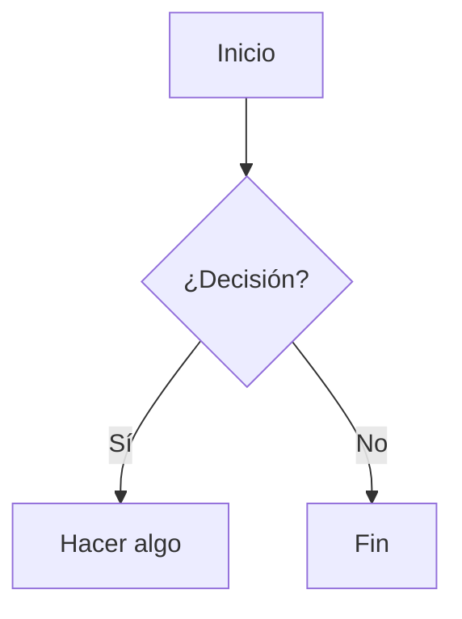

# Complementos (Plugins) — Guía de usuario

MarkdownVault incluye un sistema de **complementos (plugins)**: varias de sus funciones —Mermaid, el resaltado de sintaxis, los callouts, el botón de copiar y la matriz Eisenhower— no forman parte del núcleo fijo de la app, sino que se cargan como plugins independientes desde la carpeta `Plugins/` junto al ejecutable.

Este documento explica el sistema desde el punto de vista del **usuario**: qué son, cómo activarlos o desactivarlos, y qué hace cada uno. Si en cambio querés **construir** un plugin propio, la referencia técnica es [`GUIA-PLUGINS.md`](GUIA-PLUGINS.md).

## Cómo funcionan, en pocas palabras

- Cada plugin es una carpetita autocontenida (manifiesto `plugin.json` + un DLL) dentro de `Plugins/`. La app los detecta al arrancar, sin que tengas que instalar nada.
- Se administran desde el menú **Complementos**: cada plugin tiene un interruptor para activarlo o desactivarlo. La elección queda guardada entre sesiones.
- Si un plugin falla al activarse (por ejemplo, un manifiesto corrupto o incompatible), aparece marcado **en rojo** junto con el motivo del error — el resto de la app sigue funcionando con normalidad, un plugin roto nunca tumba MarkdownVault.
- Al activar o desactivar un plugin, la vista previa se actualiza sola (no hace falta reabrir el archivo). La única excepción son los plugins con ventana propia (ver Eisenhower más abajo): desactivarlos oculta su comando y su contribución al instante, pero liberar por completo su memoria requiere reiniciar la app.

## Plugins incluidos

| Plugin | Qué hace |
| ------ | -------- |
| [Mermaid](#mermaid) | Diagramas (flujo, secuencia, clases, Gantt…) a partir de bloques de código. |
| [Resaltado de sintaxis](#resaltado-de-sintaxis) | Colorea el código de los bloques en la vista previa. |
| [Botón de copiar](#botón-de-copiar) | Agrega un botón para copiar el contenido de cada bloque de código. |
| [Callouts](#callouts) | Alertas estilo Obsidian con título en línea. |
| [Video y Audio](#video-y-audio) | Reproduce los videos y audios del vault dentro de la nota, con controles. |
| [Eisenhower](#eisenhower) | Matriz de tareas urgente/importante con ventana dedicada. Ver guía aparte: [`EISENHOWER.md`](EISENHOWER.md). |
| [Lector de Documentos](#lector-de-documentos) | Lee el documento en voz alta con Piper, sin internet. Ver guía aparte: [`LECTOR-DOCUMENTOS.md`](LECTOR-DOCUMENTOS.md). |
| [Dictado y Transcripción de Voz](#dictado-y-transcripción-de-voz) | Transcribe un audio o dicta en vivo por micrófono con whisper.cpp, sin internet. Ver guía aparte: [`DICTADO-VOZ.md`](DICTADO-VOZ.md). |

### Mermaid

Renderiza bloques de código con la etiqueta `mermaid` como diagramas interactivos en la vista previa, usando [Mermaid.js](https://mermaid.js.org/).

**Uso**: escribí un bloque de código con lenguaje `mermaid`:

````markdown

````

Soporta flowcharts, diagramas de secuencia, de clases, de estados, Gantt, pie, mindmap y timeline. El editor trae además un menú desplegable **Mermaid ▾** en la barra de herramientas con ejemplos listos para insertar.

### Resaltado de sintaxis

Aplica coloreado de sintaxis a los bloques de código de la vista previa (usando highlight.js), detectando el lenguaje según la etiqueta del bloque (` ```csharp `, ` ```json `, ` ```bash `, etc.). No requiere ninguna acción del usuario: si el plugin está activo, el resaltado se aplica solo.

### Botón de copiar

Agrega un botón con **icono de copiar** en la esquina superior derecha de cada bloque de código de la vista previa. Al pasar el mouse por encima del bloque el botón se resalta; al hacer clic copia el contenido del bloque al portapapeles y confirma mostrando un tilde (✓) verde por un instante.

No requiere ninguna acción ni sintaxis especial: si el plugin está activo, el botón aparece solo en **todos** los lenguajes (` ```csharp `, ` ```bash `, ` ```json `, etc.). Los bloques `mermaid` se excluyen a propósito, porque ese plugin los transforma en un diagrama (no en código copiable).

### Callouts

Agrega estilo visual a las alertas tipo Obsidian y soporta la variante con **título en línea**, que Markdig no interpreta de forma nativa:

```markdown
> [!note] Título personalizado
> El contenido de la nota va acá.

> [!warning]
> También funciona sin título propio, con el título por defecto ("Warning").
```

Tipos disponibles: `note`, `tip`, `warning`, `important`, `caution` (y los que soporte la versión instalada). Cada uno tiene su propio color e icono en la vista previa.

### Video y Audio

Convierte en un **reproductor con controles** los archivos de video y audio que estén dentro del vault. Se usa la misma sintaxis de siempre para insertar una imagen — no hay que aprender nada nuevo:

```markdown

![[nota-de-voz.opus]]

```

El texto entre corchetes, si lo ponés, es lo que se muestra cuando el archivo no se puede reproducir.

**No hace falta escribirlo a mano.** En la barra de herramientas aparece el botón **🎬 Medios**, con dos opciones: *Insertar video…* e *Insertar audio…*. Cada una abre el explorador de archivos, arranca en tu carpeta `attachments/` y **solo te ofrece los formatos que la lista de abajo dice que se pueden reproducir**. Elegís el archivo y el enlace se escribe solo, con la ruta ya resuelta.

Si tenías texto seleccionado cuando apretaste el botón, ese texto pasa a ser la descripción del medio y el enlace lo reemplaza.

> [!note]
> El archivo tiene que estar **dentro del vault**. Si elegís uno de afuera, el plugin te avisa en la barra de estado en vez de insertar un enlace que se vería bien y no reproduciría nada: la vista previa solo sabe servir archivos del vault. Copialo a `attachments/` y volvé a elegirlo.

Un enlace **sin** el signo de admiración sigue siendo un enlace: `[mirá el clip](demo.mp4)` abre el archivo, no lo incrusta. La diferencia es deliberada.

**Sigue reproduciéndose mientras editás.** La vista previa se rearma con cada tecla que tocás; el plugin se acuerda del segundo exacto, del volumen y de si estaba andando, y lo restaura. No vas a perder el punto donde estabas por escribir un párrafo al lado.

**Formatos.** Por defecto entran los que el motor de la vista previa reproduce de verdad:

| Tipo | Extensiones |
| ---- | ----------- |
| Video | `.mp4` `.m4v` `.webm` `.ogv` `.mov` |
| Audio | `.mp3` `.m4a` `.aac` `.wav` `.ogg` `.oga` `.opus` `.flac` `.weba` |

La lista es **editable** desde la ventana de **Complementos**: seleccioná *Video y Audio* y vas a ver una tabla de dos columnas (*Extensión* / *Tipo*). Agregás la extensión, escribís `video` o `audio` al lado, y el cambio se aplica en el acto — no hace falta reiniciar ni recompilar. Se guarda en `formatos.json`, dentro de la carpeta del plugin.

> [!warning]
> `.mkv`, `.avi` y `.wmv` **no se reproducen**, por más que los agregues a la lista. No es una limitación del plugin: el motor de la vista previa no abre esos contenedores. Si agregás uno, el aviso debajo de la tabla te lo dice. La salida es convertir el archivo a `.mp4` (H.264) o `.webm`.
>
> Con `.mov` pasa algo parecido a medias: los que salen de un teléfono o de QuickTime andan; los exportados con códecs de edición (ProRes, HEVC) no.

**El archivo tiene que estar dentro del vault.** No es una decisión del plugin: la vista previa sirve los archivos por un host virtual (`vault.local`) mapeado a la carpeta del vault que contiene la nota que estás editando, y a ninguna otra. Un video en `C:\Videos\` no se sirve, y apuntarle con `file:///` tampoco funciona — la página de la vista previa corre en un origen sin permiso para leer el disco.

Si tenés videos afuera, hoy la salida es copiarlos adentro (o abrir esa carpeta como un vault más, con lo cual las notas que vivan **ahí** los ven).

Con **varios vaults abiertos**, el enlace se calcula contra el que contiene la nota activa —incluso si un vault está adentro de otro— así que el botón escribe la ruta correcta en todos los casos.

**Solo archivos locales.** Una dirección de internet (`https://…`) se deja como estaba, a propósito: la vista previa no sale a la red sin que se lo pidan. Los videos de YouTube todavía no están soportados.

### Eisenhower

Gestor de tareas basado en la matriz de Eisenhower (urgente × importante), con una ventana dedicada accesible desde la barra de herramientas. Es el plugin más completo del sistema — tiene su propia guía detallada:

**Ver [`EISENHOWER.md`](EISENHOWER.md).**

### Lector de Documentos

Lee el documento abierto —o solo lo que tengas seleccionado— en voz alta, usando **Piper**: un
sintetizador de voz que corre en tu máquina. No manda el texto a ningún servidor, no necesita
internet ni cuenta de nada, y funciona igual con el documento más confidencial que tengas.

Desde el menú **Lector** de la barra: leer documento, leer selección, pausar/reanudar, detener,
velocidad y elección de voz.

**Ver [`LECTOR-DOCUMENTOS.md`](LECTOR-DOCUMENTOS.md).**

### Dictado y Transcripción de Voz

Transcribe un archivo de audio (`.opus`/`.mp3`/`.m4a`/`.mp4`/`.wav`) al documento, o dicta en vivo
por micrófono insertando cada frase al hacer una pausa — usando **whisper.cpp**: reconocimiento de
voz local, sin internet ni cuentas (salvo la descarga única del modelo, ~574 MB, la primera vez).

Desde el menú **Dictado** de la barra: transcribir audio, cancelar, iniciar/detener dictado, y
estado del motor.

**Ver [`DICTADO-VOZ.md`](DICTADO-VOZ.md).**

## ¿Querés construir tu propio plugin?

El sistema de plugins es la misma vía por la que se implementaron los complementos de arriba — no hay una API privada del core. La referencia completa del contrato (SDK, tipos de contribución, ciclo de vida, empaquetado) está en [`GUIA-PLUGINS.md`](GUIA-PLUGINS.md).
