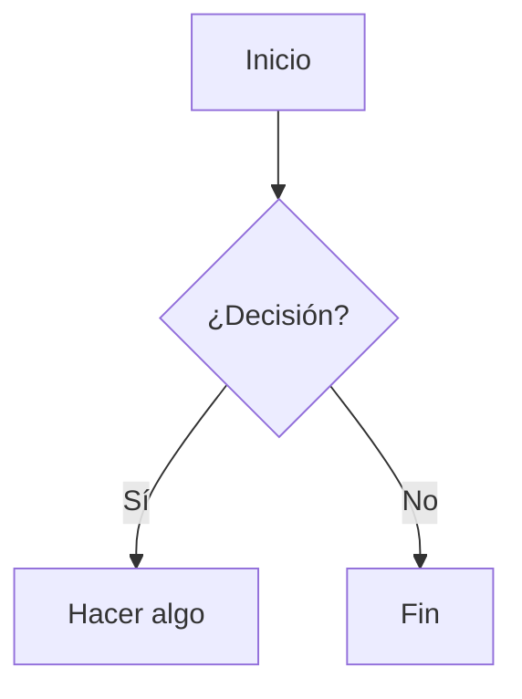

# Complementos (Plugins) — Guía de usuario

MarkdownVault incluye un sistema de **complementos (plugins)**: varias de sus funciones —Mermaid, el resaltado de sintaxis, los callouts, el botón de copiar y la matriz Eisenhower— no forman parte del núcleo fijo de la app, sino que se cargan como plugins independientes desde la carpeta `Plugins/` junto al ejecutable.

Este documento explica el sistema desde el punto de vista del **usuario**: qué son, cómo activarlos o desactivarlos, y qué hace cada uno. Si en cambio querés **construir** un plugin propio, la referencia técnica es [`GUIA-PLUGINS.md`](GUIA-PLUGINS.md).

## Cómo funcionan, en pocas palabras

- Cada plugin es una carpetita autocontenida (manifiesto `plugin.json` + un DLL) dentro de `Plugins/`. La app los detecta al arrancar, sin que tengas que instalar nada.
- Se administran desde el menú **Complementos**: cada plugin tiene un interruptor para activarlo o desactivarlo. La elección queda guardada entre sesiones.
- Si un plugin falla al activarse (por ejemplo, un manifiesto corrupto o incompatible), aparece marcado **en rojo** junto con el motivo del error — el resto de la app sigue funcionando con normalidad, un plugin roto nunca tumba MarkdownVault.
- Al activar o desactivar un plugin, la vista previa se actualiza sola (no hace falta reabrir el archivo). La única excepción son los plugins con ventana propia (ver Eisenhower más abajo): desactivarlos oculta su comando y su contribución al instante, pero liberar por completo su memoria requiere reiniciar la app.

## Plugins incluidos

| Plugin | Qué hace |
| ------ | -------- |
| [Mermaid](#mermaid) | Diagramas (flujo, secuencia, clases, Gantt…) a partir de bloques de código. |
| [Resaltado de sintaxis](#resaltado-de-sintaxis) | Colorea el código de los bloques en la vista previa. |
| [Botón de copiar](#botón-de-copiar) | Agrega un botón para copiar el contenido de cada bloque de código. |
| [Callouts](#callouts) | Alertas estilo Obsidian con título en línea. |
| [Eisenhower](#eisenhower) | Matriz de tareas urgente/importante con ventana dedicada. Ver guía aparte: [`EISENHOWER.md`](EISENHOWER.md). |

### Mermaid

Renderiza bloques de código con la etiqueta `mermaid` como diagramas interactivos en la vista previa, usando [Mermaid.js](https://mermaid.js.org/).

**Uso**: escribí un bloque de código con lenguaje `mermaid`:

````markdown

````

Soporta flowcharts, diagramas de secuencia, de clases, de estados, Gantt, pie, mindmap y timeline. El editor trae además un menú desplegable **Mermaid ▾** en la barra de herramientas con ejemplos listos para insertar.

### Resaltado de sintaxis

Aplica coloreado de sintaxis a los bloques de código de la vista previa (usando highlight.js), detectando el lenguaje según la etiqueta del bloque (` ```csharp `, ` ```json `, ` ```bash `, etc.). No requiere ninguna acción del usuario: si el plugin está activo, el resaltado se aplica solo.

### Botón de copiar

Agrega un botón con **icono de copiar** en la esquina superior derecha de cada bloque de código de la vista previa. Al pasar el mouse por encima del bloque el botón se resalta; al hacer clic copia el contenido del bloque al portapapeles y confirma mostrando un tilde (✓) verde por un instante.

No requiere ninguna acción ni sintaxis especial: si el plugin está activo, el botón aparece solo en **todos** los lenguajes (` ```csharp `, ` ```bash `, ` ```json `, etc.). Los bloques `mermaid` se excluyen a propósito, porque ese plugin los transforma en un diagrama (no en código copiable).

### Callouts

Agrega estilo visual a las alertas tipo Obsidian y soporta la variante con **título en línea**, que Markdig no interpreta de forma nativa:

```markdown
> [!note] Título personalizado
> El contenido de la nota va acá.

> [!warning]
> También funciona sin título propio, con el título por defecto ("Warning").
```

Tipos disponibles: `note`, `tip`, `warning`, `important`, `caution` (y los que soporte la versión instalada). Cada uno tiene su propio color e icono en la vista previa.

### Eisenhower

Gestor de tareas basado en la matriz de Eisenhower (urgente × importante), con una ventana dedicada accesible desde la barra de herramientas. Es el plugin más completo del sistema — tiene su propia guía detallada:

**Ver [`EISENHOWER.md`](EISENHOWER.md).**

## ¿Querés construir tu propio plugin?

El sistema de plugins es la misma vía por la que se implementaron los cuatro complementos de arriba — no hay una API privada del core. La referencia completa del contrato (SDK, tipos de contribución, ciclo de vida, empaquetado) está en [`GUIA-PLUGINS.md`](GUIA-PLUGINS.md).
